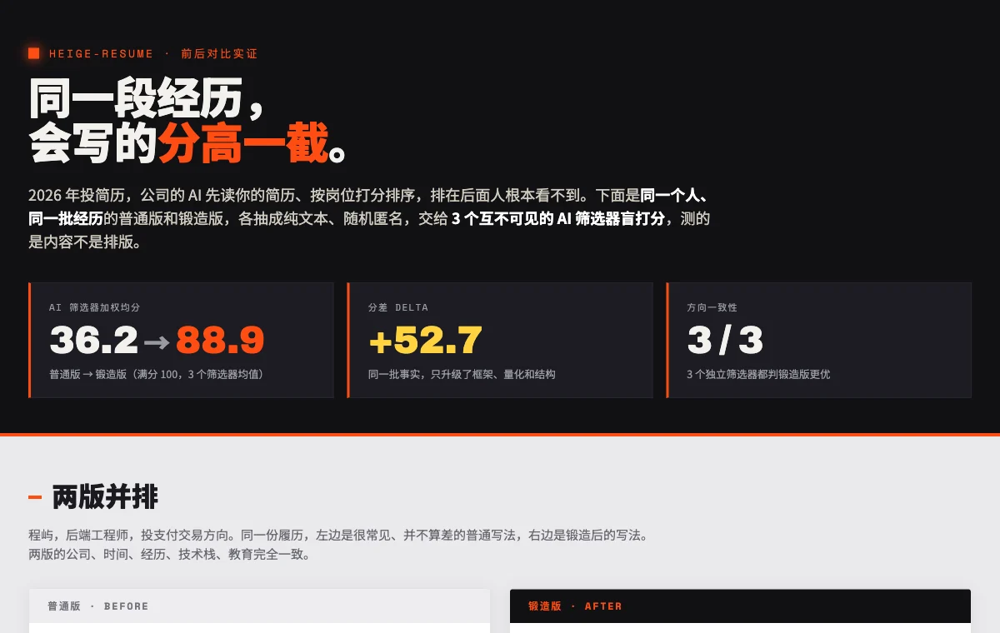
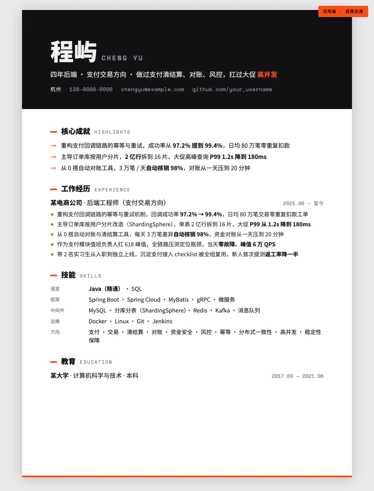
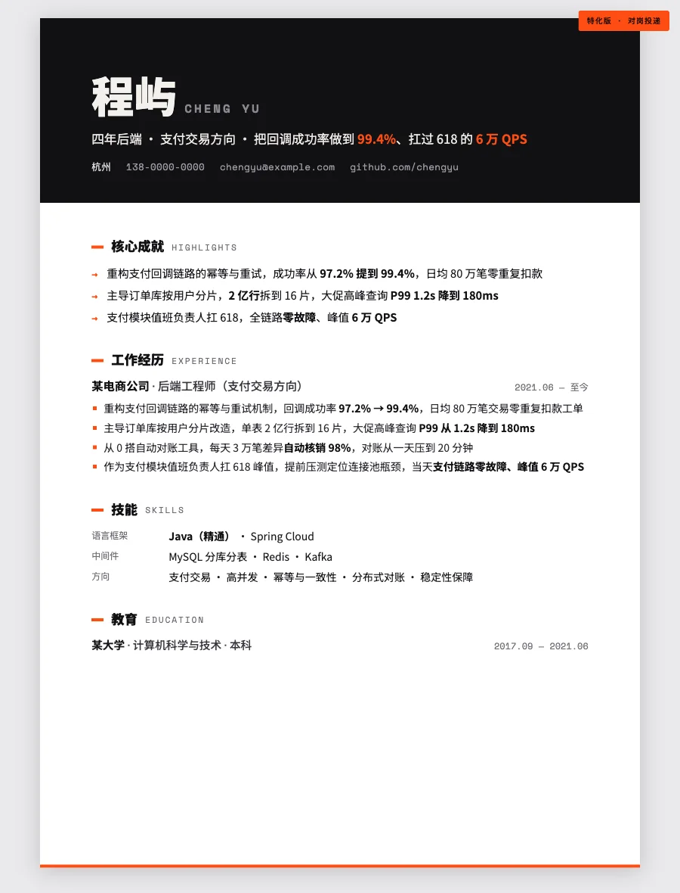
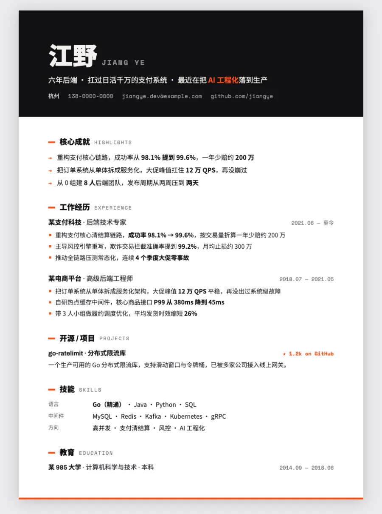
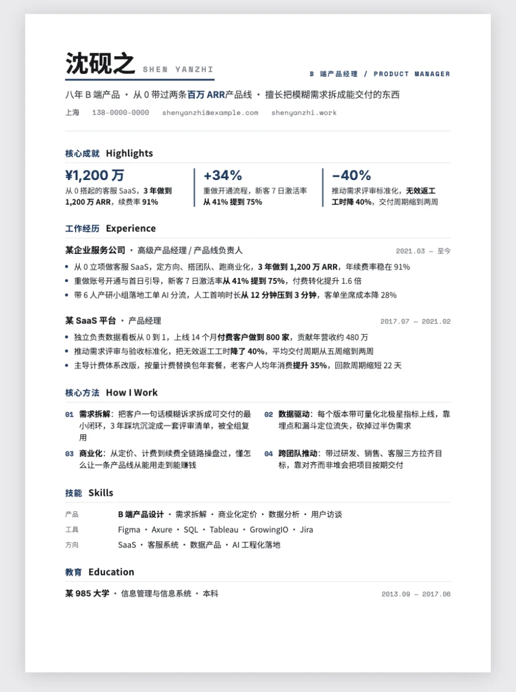
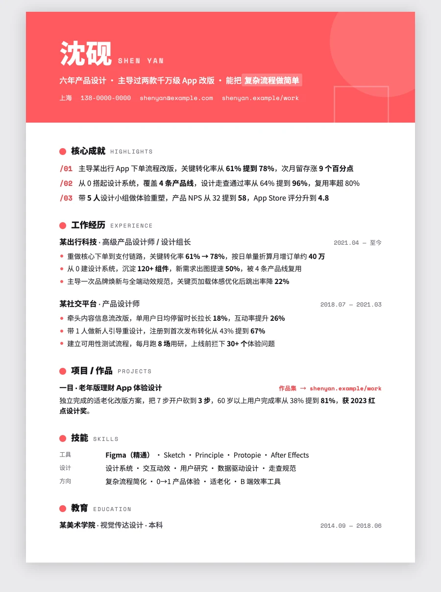
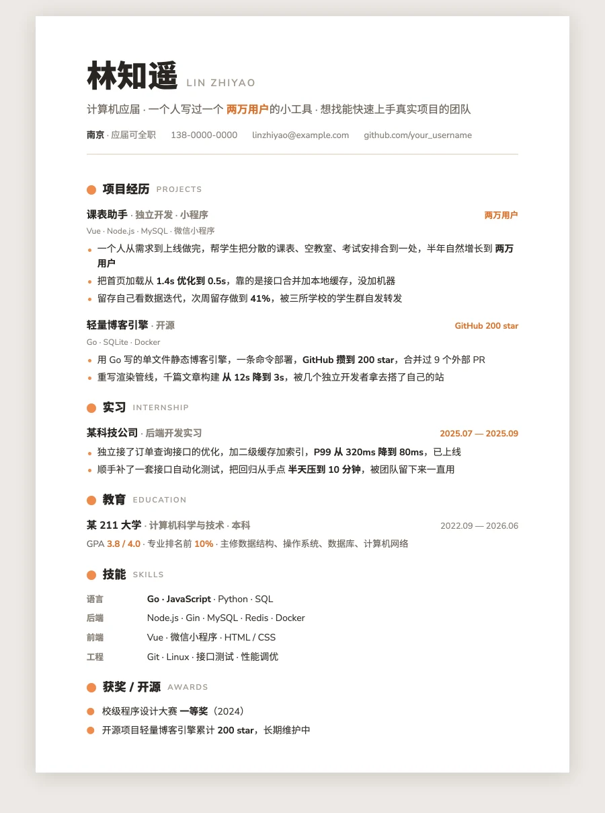
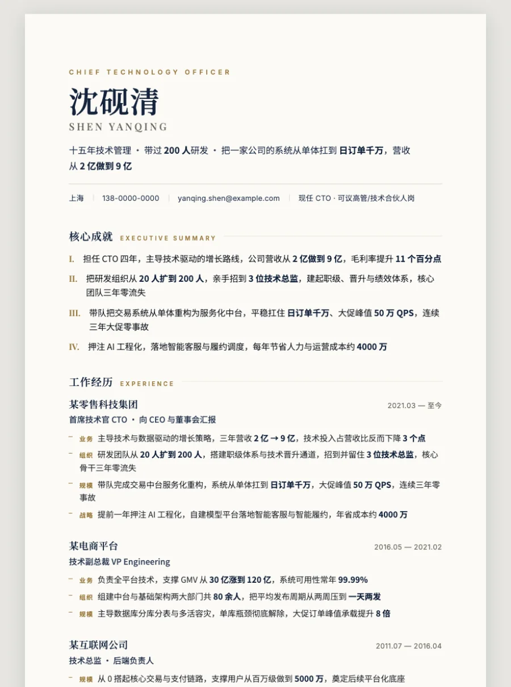

# HeiGe-Resume

<div align="center">


**简历锻造系统 | 机器先看，人再看**

2026 年投简历，机器在人之前先把你筛一遍：被关键词搜到、被 AI 按岗位打分排序，过了这关人才看得到你。同一段经历，会写的分高一截。

[这是什么](#这是什么-what-is-this) • [对比实证](#对比实证-proof) • [方法论](#核心方法论-六道锻造工序) • [样例画廊](#样例画廊-gallery) • [快速开始](#快速开始-quick-start)

<br>

<a href="https://heigeai.github.io/HeiGe-Resume/examples/comparison.html"></a>

</div>

---

## 这是什么 What is this

让 AI 把你的简历升级成**机器排得上、人也记得住**的样子。

2026 年约 83% 的公司用 AI 筛简历。你的简历先躺在简历库里被关键词搜，搜不到等于不存在；等你主动投一个岗位，公司的 AI 先读你的简历、按岗位打分排序，排在后面人根本翻不到你。过了机器这关，HR 才花六到八秒扫一眼。大多数 AI 做出来的简历是一张流水账：通篇负责什么、参与什么，没有一个数字，再套个跟八百份一样的双栏模板，两关都过不去。

HeiGe-Resume 换一种做法：**把同一段经历升级成机器和人都买账的简历。** 一句话说清你是谁，每条经历写你做成了什么，对着岗位改，排成机器读得顺的单栏。

它不只把版式做漂亮，更升级内容本身：

- ✅ **履历升级**，把「负责 XX」改写成「做成了 X、量化成 Y、靠 Z」（XYZ 公式 + 担当动词 + 正当量化）
- ✅ **两份简历**，泛用版扔进简历库把关键词铺到位（被搜到靠的是 BM25），特化版对着具体岗位改、少而精
- ✅ **过机器这关**，对着岗位用它的原词写、把资历和体量写出来，让 AI 判你对口
- ✅ **诚信红线**，强化措辞可以、编造事实不行，注入这种事讲清楚但不做
- ✅ **打开就能改**：成品自带可编辑层，点「编辑」在浏览器里直接改文字，再导出 PDF 或下载独立 HTML，不用碰代码
- ✅ **PDF 优先 + 机器可读**：A4 单文件、文字可选中、Cmd+P 导出即投递版
- ✅ **一次出两份**，同一个人的泛用版（进简历库被搜）和特化版（对岗投递），加六套跨职业样例和一套前后对比实证
- ✅ 零依赖单文件，到处都能用

**适用场景**：求职简历、跳槽简历、应届生简历、技术/产品/设计/运营简历、高管简历、自由职业者一页纸。

**支持平台**：Claude Code、Cursor、Windsurf、Cline、Aider、OpenClaw、Hermes、ChatGPT、Claude.ai 等。

> 别人交一张流水账，你交一份机器排得上、人记得住的简历。履历写成战功，对着岗位改，每条都经得起追问。

---

## 对比实证 Proof

我们拿**同一个人、同一段经历**做了普通版和锻造版，把两版各抽成纯文本、随机匿名，交给 **3 个互不可见的 AI 筛选器盲打分**（测内容不测排版）。结果：

| | AI 筛选器加权均分 | JD 匹配 | 量化结果 |
|---|:---:|:---:|:---:|
| 普通版 | 36.2 | 38.0 | 17.0 |
| 锻造版 | **88.9** | **93.3** | **91.0** |
| 分差 | **+52.7** | +55.3 | +74.0 |

3 个筛选器一致判锻造版更优。没有编造一条新成就，数字都是普通版本就隐含、只是没写出来的真实参数。锻造版赢在合法的框架和结构，不靠白字注入和关键词堆砌（那些会被现代筛选器识别并扣分）。

完整对比 + 逐条拆解见 **[在线 Demo](https://heigeai.github.io/HeiGe-Resume/examples/comparison.html)**，测试方法可复现，见 [`tools/ai-screener-eval.md`](tools/ai-screener-eval.md)。AI 筛选器日间会波动，所以我们报均值和区间、讲方向。

---

## 核心方法论 六道锻造工序

做简历之前先认清 2026 年的现实：机器在人之前就把你筛过一遍了。先被关键词搜到，再被 AI 按岗位打分排序，过了机器这关人才看得到你。锻造的功夫，是让升级后的同一条经历被搜到、被读懂、最后被人记住。

### 🎯 01 一句话定位 The One-Liner
钉死你是谁，顺带用上目标岗位的词。机器靠它判匹配，人靠它决定往下看。

### ⚒️ 02 履历升级 The Upgrade Engine
把「负责什么」改写成「做成了 X、量化成 Y、靠 Z」。强动词、可验证数字、不编造。机器和人都吃这一套。

### 🎯 03 对岗定制 Tune to the JD
把岗位的关键词挑出来、用它的原话复述、最相关的挪到最前。岗位匹配在 AI 打分里约占四成，回复率大约能翻到六倍。

### 🤖 04 机器可读 Machine-Readable
单栏真文字、阅读顺序对、标准小标题、近期靠前，不嵌图不进度条。让 AI 筛选器解析对、排得高。

### ⏱ 05 6 秒扫描 The 6-Second Scan
过了机器到人眼，让最强信号落在第一落点。层级靠字号字重留白，六秒抓到三个重点。

### 🔍 06 一页纪律 + 反作弊体检 One-Page & Anti-Gaming
一页讲完（资深最多两页）。出货前过反模板 + 反作弊（白字塞词 / 夸大无据）+ 诚信（每条经得起追问）。交付门槛。

完整方法论与使用流程见 [`SKILL.md`](SKILL.md)。

---

同一套方法论，做出八份样例。每份都是现场锻造的零依赖单文件，**A4 排版、文字可选中、Cmd+P 完美导出 PDF**。全部为虚构人物，保护隐私。点开任意预览图即可看在线 Demo。

**一个人，两份简历。** 同一个人（程屿），泛用版扔进简历库等人搜、关键词铺到位，特化版对着一个具体岗位改、少而精。当你正经找工作，这两份都要：泛用版挂在各家招聘网站被猎头搜到，每投一个岗位再用特化版。

| 预览 | 用在哪 | 怎么写 |
|:--:|:--|:--|
| <a href="https://heigeai.github.io/HeiGe-Resume/examples/generalist-resume.html"></a> | **泛用版** · 进简历库等人搜 | 关键词铺满，技能和方向覆盖全，同义叫法都带上 |
| <a href="https://heigeai.github.io/HeiGe-Resume/examples/tailored-resume.html"></a> | **特化版** · 对着一个岗位投 | 只留最对口的，镜像 JD 的词，少而精 |

**跨职业气质样例 + 前后对比实证：**

| 预览 | 气质 | 角色 |
|:--:|:--|:--|
| <a href="https://heigeai.github.io/HeiGe-Resume/examples/comparison.html"></a> | **前后对比实证** | 普通版 vs 锻造版 + AI 评分 |
| <a href="https://heigeai.github.io/HeiGe-Resume/examples/heige-resume.html"></a> | **工业 / 硬核** | 资深后端工程师（1 页） |
| <a href="https://heigeai.github.io/HeiGe-Resume/examples/pm-resume.html"></a> | **克制 / 专业** | 产品经理（1 页） |
| <a href="https://heigeai.github.io/HeiGe-Resume/examples/designer-resume.html"></a> | **设计感 / 张扬** | 设计师（1 页） |
| <a href="https://heigeai.github.io/HeiGe-Resume/examples/newgrad-resume.html"></a> | **温暖 / 简洁** | 应届毕业生（1 页） |
| <a href="https://heigeai.github.io/HeiGe-Resume/examples/executive-resume.html"></a> | **高定 / 极简** | 技术高管（2 页） |

也可以本地预览：
```bash
git clone https://github.com/HeiGeAi/HeiGe-Resume.git
cd HeiGe-Resume && python3 -m http.server 8756
# 浏览器打开 http://localhost:8756/examples/
```

> 导出 PDF：浏览器打开后 `Cmd / Ctrl + P`，目标选「另存为 PDF」，纸张 A4，边距「无」，勾选「背景图形」，导出的就是最终投递版。

---

## 快速开始 Quick Start

### 方法 1：支持 Skill 系统的平台（推荐）

适用于 Claude Code、Cursor、Windsurf、Cline：

```bash
git clone https://github.com/HeiGeAi/HeiGe-Resume.git
cp -r HeiGe-Resume ~/.claude/skills/
```

然后直接说：

```
用 HeiGe-Resume 帮我做份简历，我是五年后端
把我这段经历优化成简历，投产品经理岗
帮我把简历改得有重点、能过机器筛
```

### 方法 2：作为 System Prompt 使用

适用于 ChatGPT、Claude.ai、Aider、OpenClaw、Hermes：

1. 下载本仓库的 `SKILL.md`
2. 将内容粘贴到 AI 助手的 system prompt 或自定义指令中
3. 直接对话使用，无需特殊命令

---

## 使用指南 Usage Guide

HeiGe-Resume 会带你走完整个锻造流程：

1. **定调**：先确认投什么岗位、什么阶段、有没有目标 JD、要泛用版还是特化版、有哪些料，再挑一个气质方向。
2. **搭骨架 + 升级履历**：先写一句话定位，再把每条经历按 XYZ 公式锻造（做成 X / 量化成 Y / 靠 Z），诚信红线不碰。
3. **对岗定制（或铺关键词）+ 机器可读**：特化版对着 JD 改、最相关靠前；泛用版把关键词铺到位。两份都做到单栏真文字、标准小标题、近期靠前。
4. **写生产级代码**：A4 单文件、PDF 优先、文字可选中、中文带字体兜底。
5. **机器关和人关都体检 + 反作弊**：两关都过，没有白字塞词、每条经得起追问才交付。

### 场景示例

**升级履历，让机器多看一眼**
```
我简历全是"负责 XX"，用 HeiGe-Resume 帮我升级成有结果有数字、机器排得上的
```

**对着岗位定制**
```
用 HeiGe-Resume 帮我按这个 JD 改简历，我是五年后端投支付方向
[贴上 JD]
```

**应届生简历**
```
用 HeiGe-Resume 帮我做份应届生简历，经历不多，做干净点
```

---

## 平台兼容性 Platform Compatibility

HeiGe-Resume 本质是一套让 AI 把简历写出重点、做得能投的方法论，不绑定任何工具。**只要这个 AI 能写代码，它就能用 HeiGe-Resume。** 平台之间的差别只有两点：怎么装，以及输出怎么拿到。

| 平台 | 能不能用 | 安装方式 | 输出怎么拿 |
|------|:---:|---------|-----------|
| **Claude Code / Cursor / Windsurf / Cline** | ✅ | 放进 skill 目录 | 自动写成 .html |
| **Aider / OpenClaw / Hermes** | ✅ | 贴进 system prompt | 自动写成 .html |
| **ChatGPT / Claude.ai / 其他 AI** | ✅ | 把 SKILL.md 贴成自定义指令 | 复制代码块，自己存成 .html |

输出是单文件 HTML 简历，浏览器打开 Cmd+P 即可导出 A4 PDF，不依赖任何运行时。

> 提示：深度打法都在 `references/` 里。支持 skill 的平台会按需自动读取；纯贴 prompt 的平台，把 `SKILL.md` 和 `references/` 一起贴上，方法论最完整。

---

## 项目结构 Project Structure

```
HeiGe-Resume/
├── SKILL.md                          # Skill 主文件：六道工序 + 使用流程
├── references/                       # 设计资产
│   ├── content-upgrade-engine.md     # 履历升级（XYZ / 强动词 / 正当量化 / 诚信红线）
│   ├── ai-screener-optimization.md   # 过机器这关（BM25 被搜到 / 两份简历 / 同源 AI / 注入讲透不做）
│   ├── resume-production-spec.md      # 单文件简历硬规格（PDF + 机器可读 + 字体兜底）
│   ├── content-templates.md          # 内容速查卡（定位 / 结果不写职责 / 各阶段）
│   ├── aesthetic-directions.md       # 五种气质方向库
│   ├── anti-template-checklist.md    # 反模板 + 反作弊 + 诚信体检（交付门槛）
│   └── editable-layer.md             # 可编辑层（浏览器里直接改文字 + 导出 PDF/HTML 的 drop-in 代码）
├── examples/                         # 八个样例（全虚构人物）
│   ├── generalist-resume.html        # 程屿 · 泛用版（关键词铺满，进简历库被搜）
│   ├── tailored-resume.html          # 程屿 · 特化版（对岗少而精）
│   ├── comparison.html               # 前后对比实证 + AI 评分
│   ├── heige-resume.html             # 工业/硬核 · 资深后端工程师（1 页）
│   ├── pm-resume.html                # 克制/专业 · 产品经理（1 页）
│   ├── designer-resume.html          # 设计感/张扬 · 设计师（1 页）
│   ├── newgrad-resume.html           # 温暖/简洁 · 应届毕业生（1 页）
│   └── executive-resume.html         # 高定/极简 · 技术高管（2 页）
├── tools/                            # 本地 AI 筛选测试 harness
│   ├── ai-screener-eval.md           # 方法 + JD + 评分 rubric
│   ├── ai-screener-results.md        # 盲测共识结果
│   └── inputs/                       # 盲测纯文本输入（jd / before / after）
├── assets/previews/                  # README 用的样例预览图（WebP）
├── LICENSE · CHANGELOG.md · README.md
```

---

## 版本历史 Version History

完整记录见 [CHANGELOG.md](CHANGELOG.md)。

### v2.3.0 (2026-06-08)
- ✏️ 可编辑层：每份简历打开就能在浏览器里直接改文字（点右下角「编辑」），改完导出 PDF 或下载一份带改动的独立 HTML，改动自动存本地、刷新不丢
- 🔒 导出只走浏览器原生打印保持矢量真文字，不用 html2pdf 截图那套（不可选、ATS 读空）；工具栏不进 PDF，改后仍是 ATS 安全的真文字
- 🧩 做成一段 drop-in 代码（`references/editable-layer.md`），贴进 `</body>` 前即生效，简历和幻灯片共用

### v2.2.0 (2026-06-04)
- 📑 一次出两份落地：新增 `generalist-resume.html`（泛用版，关键词铺满进简历库被搜）和 `tailored-resume.html`（特化版，对岗少而精），同一个人程屿，一眼看出取舍差别。两份都一页、文字可选中、版本标签不进 PDF
- 🧭 SKILL 把「产两份」写进流程，给出泛用版 vs 特化版的具体差别规格（定位句 / 经历 / 技能各怎么取舍）

### v2.1.0 (2026-06-03)
- 🔎 补上「被搜到」这一层：简历库检索用 BM25，关键词密度决定排序。新增泛用版（关键词铺到位被搜到）和特化版（对岗少而精）两份简历策略
- 💡 写进同源 AI 加分点（用同一个模型改的简历，AI 裁判给分更高）；注入这件事讲清楚真相和风险，但产品不做
- ✍️ 全项目文案按人话重写一遍，去掉机器腔（双筛、对岗调频这类压缩词换成人会说的话）

### v2.0.0 (2026-06-02)
- ⚒️ 招牌从「6 秒决定去留」升级为「机器先看，人再看」，五道工序扩成六道，加入履历升级 + 对岗定制 + 机器可读
- 🤖 新增两个核心文档：履历升级（XYZ 公式 / 强动词 / 正当量化 / 诚信红线）、过机器这关（LLM 语义筛权重 / 对岗定制 / 反作弊）
- 🧪 新增 `examples/comparison.html` 前后对比实证 + `tools/` 本地 AI 筛选测试：3 个互不可见筛选器盲打分，同一段经历升级后 36.2 → 88.9（+52.7），方向一致
- 🛡️ 诚信立场：强化措辞可以、编造事实不行

### v1.0.0 (2026-06-01)
- 🎉 首次发布。五道锻造工序 + 五种气质方向库 + 五套跨职业样例，A4 可导出 PDF、文字可选中过机器筛

---

## 许可证 License

MIT License，详见 [LICENSE](LICENSE) 文件。

---

## 联系方式 Contact

- **Author**: Blake 黑哥
- **WeChat**: 488137
- **GitHub**: [@HeiGeAi](https://github.com/HeiGeAi)

---

<div align="center">

**如果这个项目对你有帮助，请给个 ⭐️ Star 支持一下！**

Made by Blake 黑哥
交一份提案，而不是一张履历表。

</div>
